# Ikoro — Architecture

> [!WARNING]
> **Partially superseded.** The stack table below predates two rounds of re-verification: SvelteKit is now 3.x (config in `vite.config.ts`), Capacitor is 8.x, the server uses **Drizzle** (not Prisma), and Tauri cannot schedule desktop notifications at all. Read [`RESEARCH-2026-10.md`](../RESEARCH-2026-10.md) §3 and [`VERSIONS.md`](../VERSIONS.md) first; [`build/`](../build/README.md) is authoritative for execution.

Back to [README](./README.md).

## 1. Shape — one monorepo, three deployables, two native shells

Decisions: [decisions.md](./decisions.md) §D2 (platforms), §D11 (monorepo), §D12 (two server apps), §D13–15 (stack, sync, no Svelte Native).

```mermaid
flowchart TB
  subgraph repo["ikoro — Bun workspaces monorepo"]
    subgraph app["apps/app — THE product (SvelteKit, adapter-static, ssr=false)"]
      UI[UI · svelte-idb · alarm engine]
      CAP["android/ — Capacitor shell"]
      TAU["src-tauri/ — Tauri v2 shell"]
    end
    LAND["apps/landing — marketing (SvelteKit static → Netlify)"]
    SRV["apps/server — sync API (SvelteKit adapter-node on Bun → Fly.io)"]
    PKG["packages/: ui · sync · config"]
  end
  UI --> PKG
  CAP --> UI
  TAU --> UI
  LAND -->|"links"| DL["APK / installers on GitHub Releases"]
  SRV --> DB[(Neon Postgres · Drizzle · Better Auth passkey)]
  UI <-- "outbox push/pull + SSE" --> SRV
```



**Why this shape:** one static build feeds both shells (`capacitor.config webDir` and `tauri.conf frontendDist` both point at `apps/app/build`); the landing never dies with the API (user rule: always-on server → separate apps); the sync server is the only always-on piece.

**Monorepo mechanics:** Bun workspaces (`"workspaces": ["apps/*", "packages/*"]`), per-app scripts via `bun run --filter <pkg> <script>` — no Turborepo until caching actually hurts. Prior-art potholes ([research.md §8](./research.md)): `svelte-package` dist/`package.json` quirks; keep shared packages intentional.

## 2. Stack

| Layer | Choice | Scope |
| --- | --- | --- |
| Runtime / PM | **Bun** (`bun`, `bunx`) | everywhere |
| Product app | **SvelteKit 3** (Svelte 5) + `@sveltejs/adapter-static`, `ssr=false` — kit config in `vite.config.ts`, **not** `svelte.config.js` | apps/app |
| UI | Tailwind v4 + **shadcn-svelte** + Lucide → `packages/ui` | app + landing |
| Storage | **`svelte-idb` 0.1.6 (IndexedDB)** — single source of truth, the user's own package, dogfooded (D23) | app |
| Mobile shell | **Capacitor 8** + `@capacitor/local-notifications` (≥ 8.3.0) + `@capacitor/app` | apps/app/android |
| Desktop shell | **Tauri v2** + `@tauri-apps/plugin-notification` — immediate notifications only; **no desktop scheduling exists** (D16) | apps/app/src-tauri |
| Landing | SvelteKit → static, deploy **Netlify** | apps/landing |
| Sync API | SvelteKit + `adapter-node` on **Bun** → **Fly.io** (one always-on machine) | apps/server |
| DB | **Neon** Postgres + **Drizzle** (`drizzle-orm` + `drizzle-kit`, `@neondatabase/serverless`) — schema hand-authored with `pgTable` | apps/server |
| Auth | **Better Auth** — **passkey** sign-in (+ backup codes for recovery) | apps/server |
| Realtime | **SSE** (`/api/v1/stream`), in-process — **no Redis** (single instance; add only if >1 instance) | apps/server |
| Validation | **Valibot** schemas in `packages/sync` shared by client + server | everywhere |
| Tests | Vitest (+ testing-library in app) | everywhere |

**Not used — Svelte Native:** see [research.md §8](./research.md) — unsupported for Svelte 5, semi-maintained, would force a full UI rewrite with zero sharing. **PWA dropped** (2026-09-26 user decision) — the browser remains dev-preview only.

## 3. Repo structure

```
ikoro/
├── package.json                  # workspaces: ["apps/*", "packages/*"]
├── packages/
│   ├── ui/                       # shadcn-svelte components (svelte-package → shared app+landing)
│   ├── sync/                     # protocol: valibot schemas, change/op types (shared app+server)
│   └── config/                   # tsconfig, eslint, prettier presets
├── apps/
│   ├── app/                      # ⭐ the product
│   │   ├── src/lib/
│   │   │   ├── db/               # svelte-idb schema.ts + repo.ts + seed.ts (app-local, NOT shared)
│   │   │   ├── alarms/           # types, scheduler, android-, desktop-, browser-scheduler, reconcile
│   │   │   ├── sync/             # outbox.ts, client.ts (uses packages/sync), stream.ts
│   │   │   ├── components/       # task/, lists/ + ui/ re-exported from packages/ui
│   │   │   ├── stores/, valibot/, utils/
│   │   │   └── platform.ts       # detectPlatform(): 'android' | 'desktop' | 'browser'
│   │   ├── src/routes/           # +layout (ssr=false), today, upcoming, lists/[id], settings, done
│   │   ├── static/icons/         # icon-192.png, icon-512.png, maskable
│   │   ├── tests/                # repo.test.ts, reconcile.test.ts, valibot.test.ts, time.test.ts
│   │   ├── android/              # Capacitor (M4-S2 init, M5 hardening)
│   │   ├── src-tauri/            # Tauri v2 (M6)
│   │   ├── capacitor.config.ts   # webDir: "build"
│   │   ├── vite.config.ts, svelte.config.js
│   ├── landing/                  # SvelteKit static → Netlify (M9): /, /download, /privacy
│   └── server/                   # SvelteKit adapter-node → Fly.io (M10)
│       ├── src/lib/db/schema.ts  # Drizzle pgTable defs: Better Auth tables + list + task
│       ├── drizzle.config.ts     # drizzle-kit: schema path, dialect, migrations dir
│       └── src/routes/api/v1/    # auth/[...all], changes, stream, health
└── docs/                         # this plan (copied in)
```

**Boundary rules (extended):** routes never touch Dexie (→ `db/repo.ts`); only `alarms/*` talks to Capacitor/Tauri notification APIs; only `apps/app/src/lib/sync/*` talks to `/api/v1` via `packages/sync`; only `apps/server` touches Prisma/Neon; `packages/*` must never import from `apps/*`; Google import ([google-tasks.md](./google-tasks.md)) lands inside the server, not the UI.

## 4. Data model — **SUPERSEDED**

> The block below is the original **Dexie** design, kept as history only. The live schema is **`svelte-idb`** (D23) and lives in [`../build/00-conventions.md`](../build/00-conventions.md) §3.1. Three differences matter: there are no transactions (so every mutation is a single-record `put()`), deletes are soft (`deletedAt`), and the sync queue is a `dirty` flag on each record rather than a separate `outbox` store.

```ts
// SUPERSEDED — Dexie. The live schema is svelte-idb; see build/00-conventions.md §3.1.
// apps/app/src/lib/db/schema.ts
import Dexie, { type Table } from 'dexie';

export type Priority = 0 | 1 | 2 | 3; // 0 none · 1 low · 2 med · 3 high

export interface TaskList {
  id: string;            // crypto.randomUUID()
  name: string;
  sortOrder: number;     // "My order"
  createdAt: string;     // ISO
  updatedAt: string;
  googleTaskId?: string; // v2 sync reserved
}

export interface Task {
  id: string;
  listId: string;
  title: string;         // ≤1024 (parity with Google)
  notes: string | null;  // ≤8192
  dueDate: string | null; // YYYY-MM-DD — Google-syncable part (google-tasks.md §4)
  dueTime: string | null; // HH:mm — LOCAL ONLY (Google API discards time)
  priority: Priority;
  parentId: string | null; // subtasks reserved (v1.1)
  repeat: null | 'daily' | 'weekdays' | 'weekly' | 'monthly'; // reserved (v1.1)
  completedAt: string | null;
  alarmAt: string | null;   // ISO — derived: dueDate+dueTime when alarm enabled
  alarmId: string | null;   // platform id from scheduler
  alarmFiredAt: string | null;
  sortOrder: number;
  createdAt: string;
  updatedAt: string;
  deletedAt: string | null;  // tombstone until server acks (sync, M11)
  rev: number | null;        // server revision of last sync (null = never)
  googleTaskId?: string;
}

export class IkoroDB extends Dexie {
  lists!: Table<TaskList, string>;
  tasks!: Table<Task, string>;
  constructor() {
    super('ikoro');
    this.version(1).stores({
      lists: 'id, sortOrder, updatedAt',
      tasks: 'id, listId, completedAt, dueDate, alarmAt, updatedAt, parentId',
    });
  }
}
export const db = new IkoroDB();
```

- Timestamps: ISO 8601 strings (sortable, export-friendly). IDs: `crypto.randomUUID()`.
- Alarm notification ids: stable 32-bit hash of `taskId` (`utils/id.ts::hashId`) — re-scheduling never leaks duplicate notifications.
- Migration policy: **superseded.** The live policy is a frozen `version: 1` schema (D23); svelte-idb's `onUpgrade` is a raw hook, so the plan avoids upgrades entirely.
- **Sync fields live here from day one** so M11 needs no migration: `deletedAt` (tombstone), `rev` (server cursor per row). Lists carry the same pair. **Never synced:** `alarmId`, `alarmFiredAt` (device-scoped — re-derived by `rescheduleAll()` after every pull). **Synced with full fidelity** through *our* server (unlike Google): `dueTime`, `priority`, `repeat`, `alarmAt`.

## 5. Platform detection & scheduler selection

```ts
// apps/app/src/lib/platform.ts
import { Capacitor } from '@capacitor/core';
export type Platform = 'android' | 'desktop' | 'browser';
export function detectPlatform(): Platform {
  if (Capacitor.isNativePlatform()) return 'android';
  if ('__TAURI_INTERNALS__' in window || '__TAURI__' in window) return 'desktop';
  return 'browser';
}
```

| Platform | Scheduler | Firing mechanism |
| --- | --- | --- |
| android | `android-scheduler.ts` | `@capacitor/local-notifications` — `setExactAndAllowWhileIdle` + `allowWhileIdle: true` (Tier 1, [alarms.md](./alarms.md)) |
| desktop | `desktop-scheduler.ts` | `@tauri-apps/plugin-notification` `schedule.at` — OS-scheduled on Windows/macOS **+ in-process timer backstop** (long-running app; Linux = timer primary) |
| browser | `browser-scheduler.ts` | dev-preview only: in-page timer + SW notification, honest copy |

- UI reads `detectPlatform()` only to swap copy (browser limitation note, desktop install nudge) and to gate the permission-health banner.
- Reconcile (`reconcile.ts`) stays **platform-agnostic**: store ↔ `getPending()` diffing per [alarms.md](./alarms.md) §2.4–2.5 — the desktop scheduler plugs into the same interface.

## 6. Sync protocol (`packages/sync` + apps/server — M10/M11)

**Server tables (Drizzle):** `user`, `session`, `account`, `verification`, `passkey`, plus the `twoFactor` backup-code table (Better Auth) · `list` · `task` — app rows: `id` (uuid, client-generated), `userId`, payload columns, `updatedAt` (client LWW clock), `rev BIGSERIAL` (global monotonic cursor), `deletedAt` (tombstone).

**Endpoints** (Bearer session, Valibot-validated from `packages/sync`):

```
GET  /api/v1/changes?since=<rev>&limit=500  → { changes: [...rows incl. tombstones], nextRev }
POST /api/v1/changes                        → { ops: ChangeOp[] } batch upsert → { applied, rev }
GET  /api/v1/stream                         → SSE: "change" { rev }, "hello", keepalive 25s
GET  /api/v1/health                         → { status, rev } (no auth — health-page playbook)
```

**Rules:** LWW per record — server accepts an op iff `op.updatedAt > row.updatedAt` (tie → server wins, op rejected back); deletes are tombstones (hard-purge only via maintenance); server assigns `rev` on every applied op → client persists cursor. **Client queue = the `dirty` flag on each record** (`0 | 1`, indexed), *not* a separate `outbox` store — svelte-idb has no transactions, so a single `put()` has to mark the change and the need to push at the same time (D23, [build/M11](../build/M11-sync-client.md)). Flushes on: launch · resume · `online` · SSE signal. SSE handler = *refetch `since=cursor`* (no payload push — server stays dumb). One LWW merge implementation in `packages/sync`, consumed by both sides.

## 7. apps/server (M10)

- SvelteKit routes only: `/api/v1/*` `+server.ts` + Better Auth handler `/api/auth/[...all]`; `adapter-node`; runs on **Bun**.
- Drizzle ORM over `@neondatabase/serverless` (`drizzle-orm/neon-http`), schema hand-authored with `pgTable`, migrations via `drizzle-kit`. Better Auth wired with `@better-auth/drizzle-adapter`: `passkeys` plugin + passwordless recovery codes (device loss!), 30-day sessions. **❓ verify at M10:** whether the drizzle adapter accepts a `neon-http` instance with the hand-authored schema ([decisions.md](./decisions.md) open questions).
- SSE: in-memory subscriber set per userId; an applied push emits `{rev}` to that user's connections. **Single instance → no Redis/pub-sub.** Naive in-memory rate limit per IP on `/api/v1/*`.
- Deploy: Fly.io (Bun container running `adapter-node`, **one always-on machine — `auto_stop_machines = false`** so SSE subscribers are never dropped). Env: `DATABASE_URL`, `BETTER_AUTH_SECRET`, `APP_ORIGIN` (landing origin; Bearer tokens, no cookies).

## 8. apps/landing (M9)

SvelteKit static → **Netlify**. Pages: `/` (name story, value props, screenshots), `/download` (APK via GitHub Releases, desktop installers), `/privacy` (local-first statement), `/changelog`. Shares `packages/ui`; zero trackers; no PWA claims — platforms are Android + desktop.

## 9. Capacitor & Tauri wiring

| | Capacitor (M4-S2 init → M5 hardening) | Tauri (M6) |
| --- | --- | --- |
| Install | `bun add @capacitor/core @capacitor/android @capacitor/app @capacitor/local-notifications` + `-D @capacitor/cli`; `bunx cap init ikoro com.michaelobele.ikoro --web-dir build && bunx cap add android` | `bun add -D @tauri-apps/cli`; `bunx tauri init` inside `apps/app` (frontendDist `"../build"`, devUrl `http://localhost:5173`) |
| Config | `capacitor.config.ts`: `webDir: 'build'`, `android: { allowMixedContent: false }` | `src-tauri/tauri.conf.json`: `frontendDist: "../build"`, bundle identifiers/icons |
| Manifest / perms | `SCHEDULE_EXACT_ALARM`, `POST_NOTIFICATIONS`, `RECEIVE_BOOT_COMPLETED`; `INTERNET` (sync only) | macOS usage strings if prompted; none on Windows/Linux |
| Notify API | `LocalNotifications.schedule({ schedule: { at, allowWhileIdle: true } })` | `send({ schedule: { at: { date, allowWhileIdle, repeating: false } }, extra: { taskId } })` |
| Tap → task | `localNotificationActionPerformed` | notification `onAction` / `onClick` |
| Resume/focus hook | `App.addListener('appStateChange')` → `ensureReady()` + reconcile | `onFocusChanged` window event → same reconcile |
| Build | `bun run build && bunx cap sync android` → `./gradlew assembleDebug` | `bun run build && bunx tauri build` |

## 10. Backup format (M7) — Valibot-validated

```json
{
  "app": "ikoro",
  "schemaVersion": 1,
  "exportedAt": "2026-09-26T00:00:00.000Z",
  "lists": [{ "id": "…", "name": "Tasks", "sortOrder": 0 }],
  "tasks": [{ "id": "…", "listId": "…", "title": "…", "dueDate": null, "dueTime": null, "priority": 0, "alarmAt": null }]
}
```

Import rules: validate with `exportSchema` → merge by id (keep newest `updatedAt`) → clear `alarmId`/`alarmFiredAt` (platform ids don't transfer) → `rescheduleAll()`.

## 11. Security & privacy

- App data: IndexedDB only; the app makes **zero network calls until sync is enabled** (M11) — then only to our server over TLS with Bearer session.
- Server: no analytics, no third-party calls; Prisma parameterized; Bearer ≠ cookies (no CSRF surface); per-IP rate limit; landing sets no cookies and tracks nothing.
- Credentials: passkeys (+ backup codes) only — no passwords stored. Export file = plaintext JSON (the user's own data); document that it contains task content.

---

Back to [README](./README.md) · Next: [milestones.md](./milestones.md)
